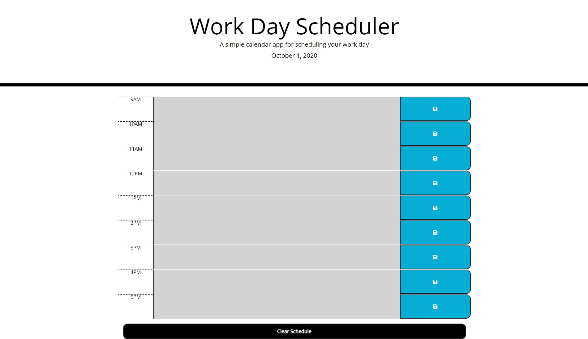

# Day Planner

## Description
Do you have a busy schedule and don't know where to begin?\
This day planner is the perfect fit for you!\
You can manage your time efficiently and see what events have passed and which ones are upcoming.\
It'll remember what you have on your schedule if its been saved, even after a refresh.\
After each day, you can go ahead and clear the schedule for your next day appointments.

## Links
* Depoloyed application: https://tsinmoua.github.io/Day-Planner/
* Repository: https://github.com/tsinmoua/Day-Planner

## Usage Instructions
Enter in the events for the day at the correct time-slots and hit the save button.\
Upcoming events will be green, current events will be red, and past events will be gray.
Add/takeaway events as you see fit your schedule. At the end of the day just simply hit the clear schedule button and you are ready for the next day.

## Installion Instructions
N/A

## Credits/Thanks
N/A

## License Information
N/A